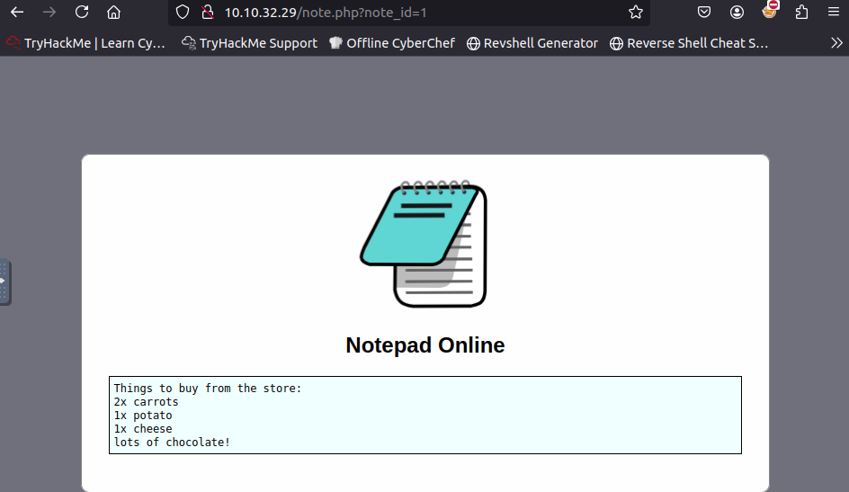
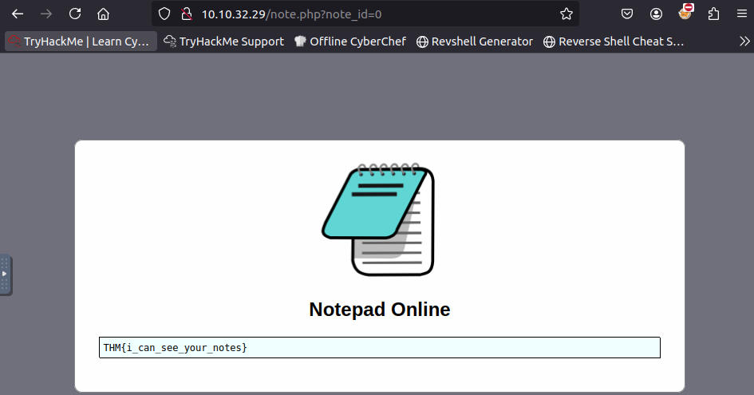

From this task, we are given credentials to login into Online Notepad Service.

After logging in with these credentials, i suspected an Insecure Direct Object Reference (IDOR) vulnerability.

This is what the webpage shows:

By changing the ID parameter of the url link from http: //10.10.32.29/note.php?note_id=1 to http: //10.10.32.29/note.php?note_id=0, i was taken to another notepad that shows:

Hence, this webpage has an Insecure Direct Object Reference (IDOR) vulnerability.

ANSWER: THM{i_can_see_your_notes}