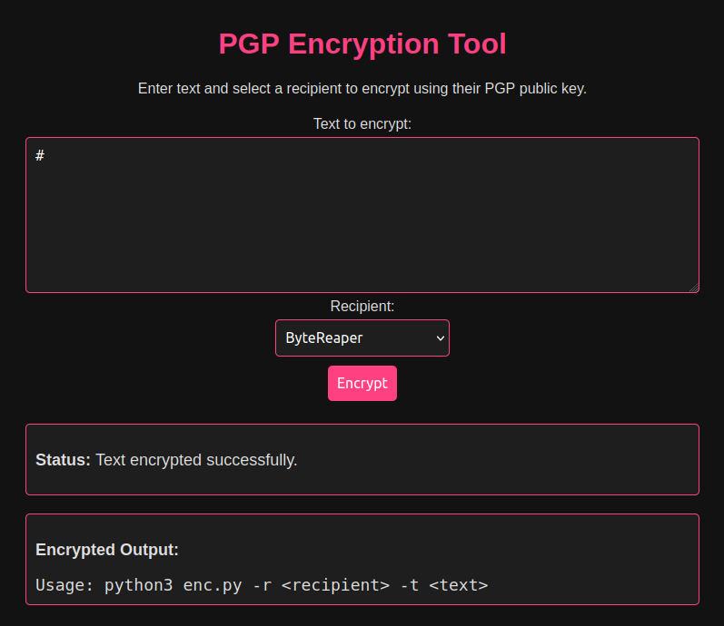
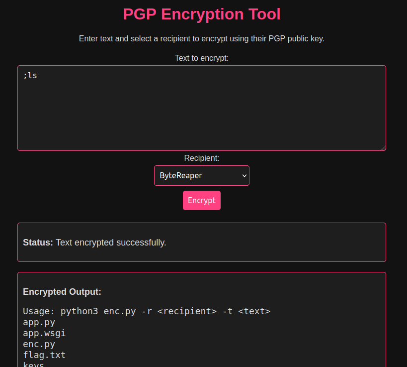
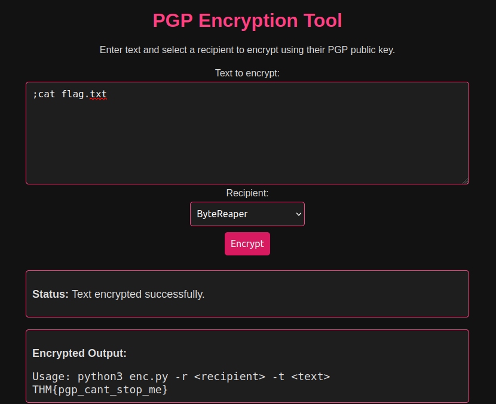

Task has shown that we found an encryption tool hosted on the server.

Since it is an encryption tool, i tried to run a test on this encryption tool.

Test result:

We were shown the python script of the encryption tool. Hence, I tried to list information of files in directory

List result:

Under the list of files in this directory, i noticed a flag.txt files. Hence with the command : ';cat flag.txt', i was able to solve this task.

Cat result:

ANSWER: THM{pgp_cant_stop_me}
